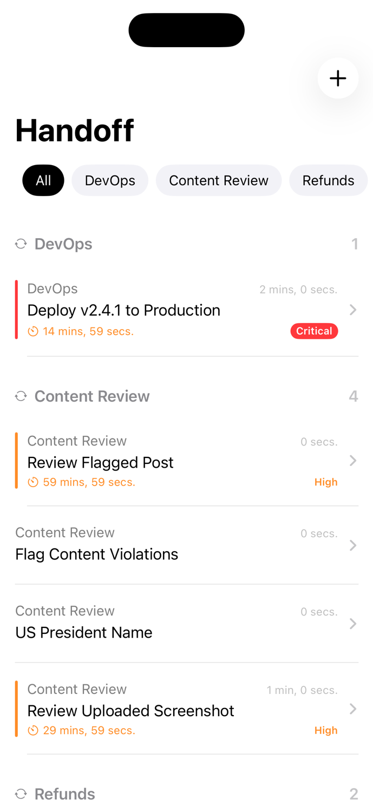
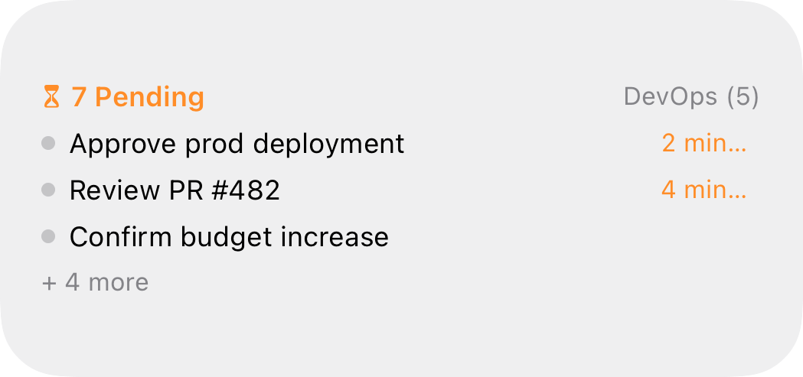
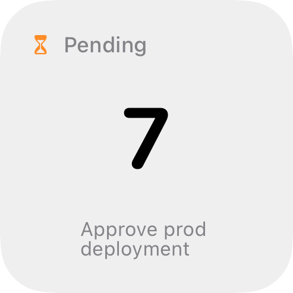

# Handoff

Mobile-first human oversight for AI workflows. Review, approve, and respond to AI agent requests from your phone.

## Screenshots

| Home | Live Activity | Lock Screen Widget |
|------|--------------|-------------------|
|  |  |  |

## Structure

```
ios/        # Swift iOS app with Live Activities & widgets
server/     # Go backend with APNs push, SSE, webhooks
screenshots/
design/     # Pencil design files
```

## Server

```bash
cd server
cp .env.example .env  # configure your env
go run ./cmd/handoff/
```

## iOS

Open `ios/Handoff.xcodeproj` in Xcode and run.
